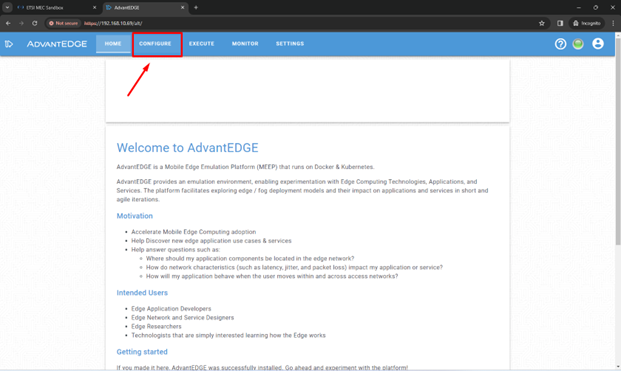
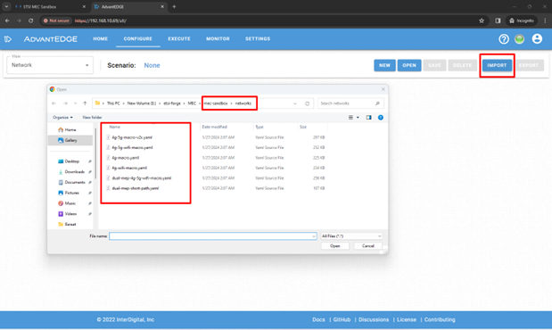

# ETSI MEC Sandbox Setup Guide

## 1. Prepare the Environment
- Make sure you have a **fresh installation** of Ubuntu 22.04 (VM or metal).
- Install Python 3 and Ansible:

```bash
sudo apt update
sudo apt install python3 python3-pip ansible -y
```

---

## 2. Clone Repositories

### ETSI MEC Sandbox
```bash
cd ~
git clone --depth 1 -b STF678_Task_5_TTF_T043 https://labs.etsi.org/rep/mec/etsi-mec-sandbox.git
```

### ETSI MEC Sandbox Frontend
```bash
cd ~
git clone --depth 1 -b STF678_Task_5_TTF_T043 https://labs.etsi.org/rep/mec/etsi-mec-sandbox-frontend.git
```

---

## 3. Run Ansible Setup
```bash
cd mec-sandbox-runtime-ansible-setup
source run_playbook.sh
```
> Wait until all tasks are complete. This may take some time.  
> Once setup is complete, **reboot the VM** to apply all changes.

---

## 4. GitHub OAuth App Setup

Go to **GitHub Developer Settings**:
1. Navigate to:  
   `User Account → Settings → Developer settings → OAuth Apps → New OAuth App`
2. Fill in the details:
   - **Application Name:** `ETSI MEC Sandbox`
   - **Homepage URL:** `https://<IP-address-of-local-VM>`
   - **Application description:** *(Optional)*
   - **Authorization callback URL:**  
     `https://<IP-address-of-local-VM>/platform-ctrl/v1/authorize`

---

## 5. Install Dependencies
```bash
sudo apt install python3-pip
pip install pyyaml
```

---

## 6. Configure Secrets

Navigate to:
```bash
cd etsi-mec-sandbox-frontend/config/
```

Edit the secrets file:
```bash
sudo nano ~/mec-sandbox/config/secrets.yaml
```
or open in VSCode.

Example `secrets.yaml`:
```yaml
meep-oauth-github:
  client-id: ""
  secret: ""
```

- Replace `client-id` and `secret` with your GitHub OAuth app values.

Copy these values to:
```bash
cd ~/etsi-mec-sandbox/config
nano secrets.yaml
```
Paste all values.

### Create Secrets
```bash
python3 ~/etsi-mec-sandbox/config/configure-secrets.py set ~/etsi-mec-sandbox/config/secrets.yaml
```

---

## 7. Update `.meepctl-repocfg.yaml`

```bash
cd ~/etsi-mec-sandbox/config
```

Edit the file and update:

```yaml
# Line 15: Change the version
version: 1.11.0

# Line 41: Change host name
host: <VM-IP>

# Line 43: Set HTTPS-only
https-only: false

# Line 51: Set CA
ca: self-signed

# GitHub Auth Section - Line 82: Update redirect URI
redirect-uri: https://<VM-IP>/platform-ctrl/v1/authorize
```

---

## 8. Configure meepctl

Run installation script:
```bash
~/etsi-mec-sandbox/go-apps/meepctl/install.sh
```

Configure IP and git directory:
```bash
meepctl config ip <VM-IP-address>
meepctl config gitdir ~/etsi-mec-sandbox
```

---

## 9. Build and Deploy Frontend

```bash
cd etsi-mec-sandbox-frontend
./build.sh && ./deploy.sh && meepctl deploy dep
```

Fix Docker registry permissions:
```bash
sudo chown -R 1001:1001 ~/.meep/docker-registry
```

Deploy all components:
```bash
meepctl build all --nolint
meepctl dockerize all
docker image prune -f
meepctl deploy core
```

---

## 10. Access Sandbox
Use your VM IP in a browser:  
`https://<VM-IP>`

---

# MEC Sandbox Configuration Guide

## Download Monaco Map

```bash
cd ~
wget https://geodata.maptiler.download/extracts/osm/v3.11/2020-02-10/europe/osm-2020-02-10-v3.11_france_monaco.mbtiles
mv ~/osm-2020-02-10-v3.11_france_monaco.mbtiles ~/.meep/omt/
```

Restart the **open-map-tiles** container:

```bash
kubectl get pods -A
kubectl exec -it <meep-open-map-tiles-pod-name> -c open-map-tiles -- /bin/sh -c "kill 1"
```

---

## Login as Admin

After login, three new pods are created. Find the namespace:

```bash
kubectl get pods -A
kubectl exec -it pod/meep-postgis-0 -- sh
psql -U postgres
\c meep_auth_svc
```

### Update Existing User to Admin
```sql
SELECT * FROM users;
UPDATE users SET role = 'admin' WHERE id = 1;
```

### Add a New Admin User
```sql
INSERT INTO users (provider, username, password, sboxname, role)
VALUES ('github', '<github-user>', '', '<sandbox>', 'admin');
```

**Example:**
```sql
INSERT INTO users (provider, username, password, sboxname, role)
VALUES ('github', 'M-Hamza007', '', 'sbxc8xbgqx','admin');
```

### Delete Non-Admin User
```sql
SELECT * FROM users;
DELETE FROM users WHERE id = 1;
```

---

## Add Network Scenarios

⚠️ **Prerequisite:** Must be logged in as an **admin**.

1. Open a new browser tab:
   ```
   https://<IP-address>/alt
   ```
2. Click **Configure**.
3. Clone the network scenarios repo:
   ```bash
   git clone https://forge.etsi.org/rep/mec/mec-sandbox.git
   ```
4. In the web UI:
   - **Configure → Import**
   - Select a network scenario from cloned repo
   - Click **Save → OK**
   - 
   - 

5. Download ETSI Labs network scenario:
```bash
wget https://labs.etsi.org/rep/mec/etsi-mec-sandbox-frontend/-/blob/STF678_Task_5_TTF_T043/networks/4g-5g-mc-v2x-fed-iot.yaml
```

1. Import in web UI:
   - **Configure → Import**
   - Select `.yaml` file
   - Click **Save → OK**

> ⚠️ This scenario is in development and not publicly available yet.

